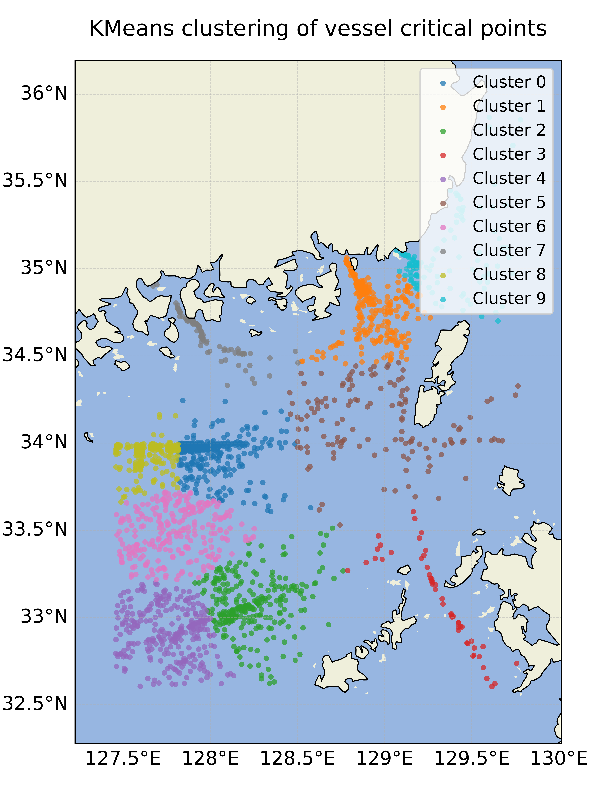
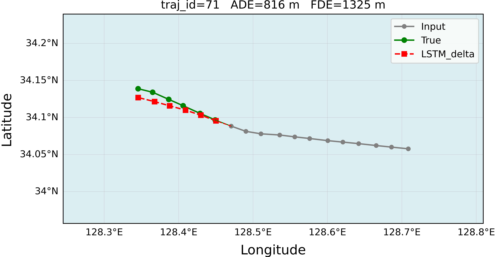
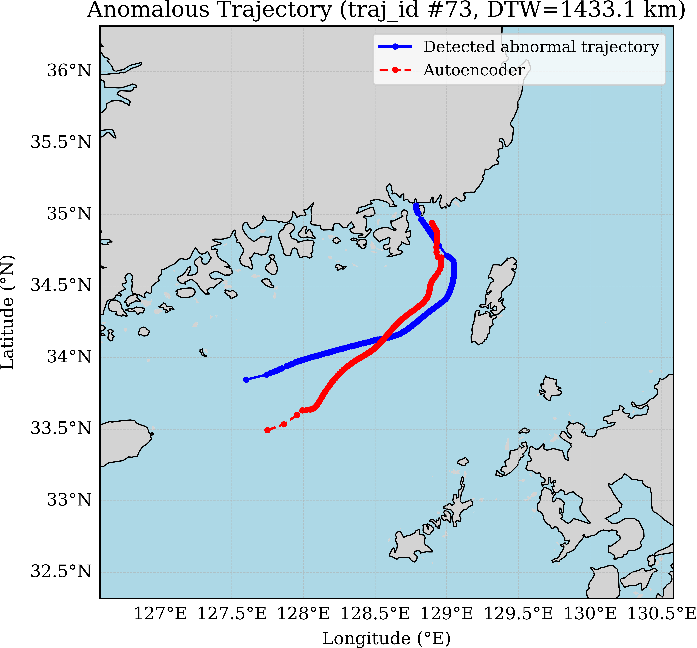
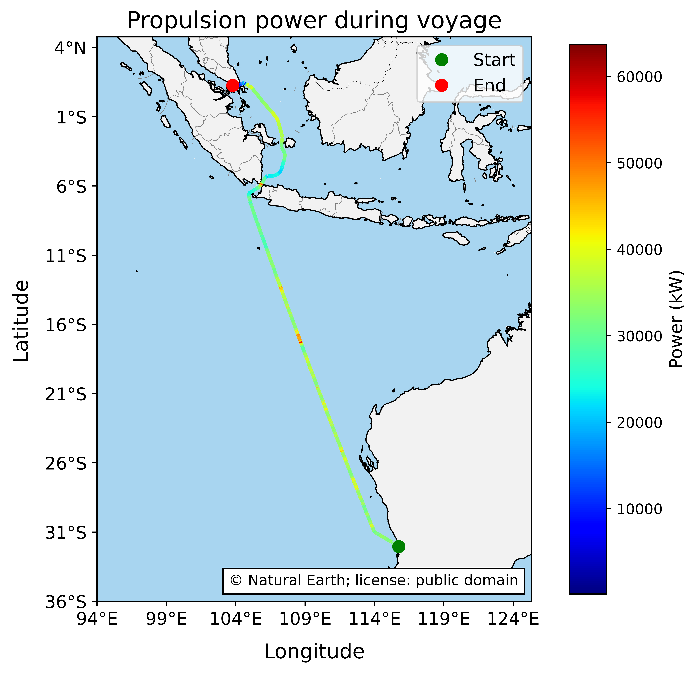
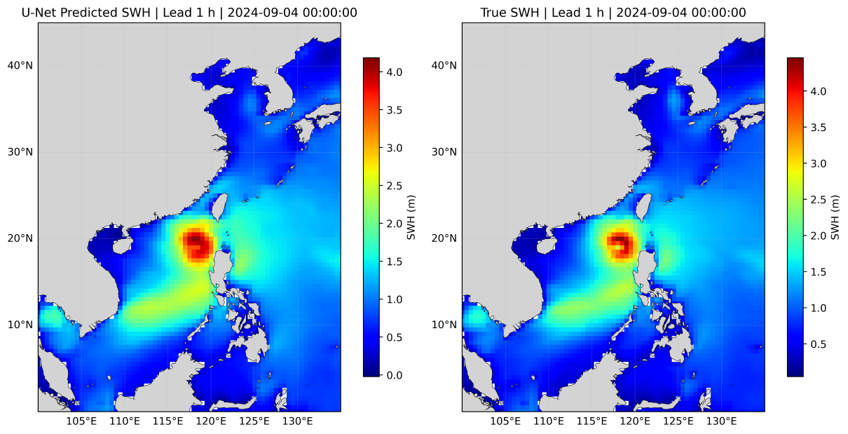
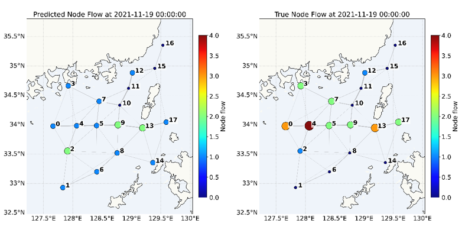

# Data Science for Maritime Transportation

This repository provides the teaching code and example datasets for **Data Science for Maritime Transportation**. The code is organized by book chapter and is intended to help readers reproduce the demonstrations, understand the modeling workflow, and adapt the examples to their own maritime data-analysis tasks.

The examples are mainly provided as Jupyter notebooks. They cover common data-science tasks in maritime transportation, including AIS data processing, trajectory analysis, clustering, prediction, anomaly detection, propulsion-power estimation, ocean-wave modeling, graph-based traffic-flow forecasting, and ETA prediction.

If you use this repository, the teaching code, or the example datasets in your research or teaching, please cite the book as follows:

```text
Zhao, L. (2026). Data Science for Maritime Transportation. Springer.
```

BibTeX format:

```bibtex
@book{zhao2026data,
  author    = {Zhao, Liang},
  title     = {Data Science for Maritime Transportation},
  year      = {2026},
  publisher = {Springer}
}
```

## Recommended Python Version

The recommended Python version is:

```bash
Python 3.10
```

Python 3.10 is recommended because it provides good compatibility with the scientific-computing, machine-learning, geospatial, and deep-learning packages used in the notebooks.

## Environment Configuration

Install the required packages from the project root directory:

```bash
python -m pip install --upgrade pip
pip install -r requirements.txt
```

The `requirements.txt` file contains the dependencies needed to run the teaching examples in this repository.

## Suggested Workflow for Readers

A typical workflow is:

1. Prepare a clean Python environment.
2. Install the required dependencies using `requirements.txt`.
3. Open the notebook for the target chapter.
4. Run the notebook cells sequentially.
5. Review the intermediate outputs, figures, and evaluation results.
6. Modify parameters, model settings, or input data to further explore the example.

## Project Description

This repository contains code examples for selected chapters of the book. Each chapter focuses on a representative data-science task in maritime transportation.

### Chapter 1: Introduction to Maritime Data Science

Chapter 1 provides an introductory example for maritime data-science analysis. It helps readers become familiar with the basic workflow of loading data, inspecting variables, conducting simple exploratory analysis, and preparing maritime datasets for later modeling tasks.

### Chapter 2: AIS Data Processing

Chapter 2 focuses on AIS data handling. The example demonstrates how to process vessel movement records, organize navigation-related variables, and prepare AIS data for trajectory analysis, visualization, and downstream machine-learning tasks.

### Chapter 3: Vessel Trajectory Analysis

Chapter 3 introduces trajectory-oriented analysis based on maritime movement data. The example includes trajectory organization, time-series processing, and preparation of vessel tracks for later tasks such as clustering, prediction, and behavioral analysis.

### Chapter 5: Fundamental VesseL Modeling

Chapter 5 provides a basic Vessel modeling example. It introduces common modeling steps, including 3 DOF model, control design, state estimator, and environment disturbances, serving as a foundation for the more advanced chapters.

### Chapter 6: Pattern Mining and Clustering

Chapter 6 focuses on discovering movement patterns from vessel trajectory data. The example demonstrates how to extract trajectory features, measure similarity, identify representative traffic patterns, and apply clustering methods to maritime movement analysis. 
<p align="center">
  
</p>

### Chapter 7: Vessel Trajectory Prediction Using Deep Learning

Chapter 7 presents a deep-learning example for vessel trajectory prediction. It demonstrates how historical vessel movement information can be used to train sequence-based models and predict future vessel states or positions.

<p align="center">
  
</p>

### Chapter 8: Vessel Behavior Anomaly Detection Using Deep Learning

Chapter 8 focuses on anomaly detection of vessel behavior. The example uses training and testing AIS datasets to demonstrate reconstruction-based deep-learning methods for identifying abnormal vessel movement patterns.
<p align="center">
  
</p>

### Chapter 9: Vessel Propulsion-Power Estimation with AIS Data

Chapter 9 demonstrates how AIS data and environmental information can be used to estimate vessel propulsion power. The example includes resistance-related calculations, environmental effects, and power estimation for teaching purposes.
<p align="center">
  
</p>


### Chapter 10: Regional Ocean-Wave Modeling Using Deep Learning

Chapter 10 introduces a deep-learning workflow for regional ocean-wave modeling. The example demonstrates how gridded oceanographic and meteorological data can be processed and used for wave-related prediction tasks.

<p align="center">
  
</p>

### Chapter 11: Maritime Traffic-Flow Forecasting Using Graph Neural Networks

Chapter 11 focuses on graph-based maritime traffic-flow forecasting. The example demonstrates how maritime traffic can be represented as a graph and how graph neural networks can be used to model spatial-temporal traffic-flow patterns.
<p align="center">
  
</p>

### Chapter 12: Vessel Estimated Time of Arrival Prediction Using Machine Learning

Chapter 12 presents a machine-learning example for vessel estimated time of arrival prediction. The example covers feature preparation, model training, prediction, and evaluation for ETA-related maritime decision-support applications.

## Note
The dataset for Chapter 10 is too large for GitHub. The readers can access the dataset combined_wind_wave_2023.nc and combined_wind_wave_2024.nc in the Kaggle link [www.kaggle.com]

## License

This repository is released for academic, teaching, and research use. Unless otherwise stated, the source code is provided under the MIT License.

Copyright (c) 2026 Liang Zhao

Permission is hereby granted, free of charge, to any person obtaining a copy of this software and associated documentation files to use, copy, modify, merge, publish, distribute, sublicense, and/or sell copies of the software, subject to the condition that the copyright notice and this permission notice shall be included in all copies or substantial portions of the software.

The software is provided "as is", without warranty of any kind, express or implied, including but not limited to the warranties of merchantability, fitness for a particular purpose, and noninfringement. In no event shall the author or copyright holder be liable for any claim, damages, or other liability arising from the use of the software.
